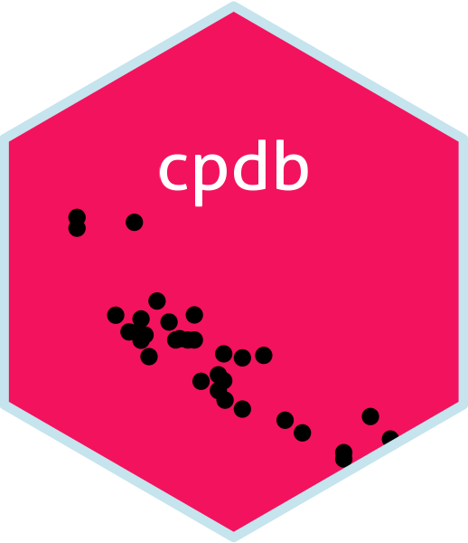
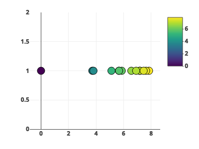

<!-- README.md is generated from README.Rmd. Please edit that file -->

# cpdb R Package 

<!-- badges: start -->
<!-- badges: end -->

## Description

This R package allows the user to get the intramolecular contacts of a
specific residue from a solved PDB protein structure. Its use is
intended to researchers in genetic mutations.

## Installation

Install the package

``` r
library(devtools)
devtools::install_github("karlapenag/cpdb", build_vignettes = TRUE)
```

``` r
library(cpdb)
library(hexSticker)
library(ggplot2)
```


## `get_contacts()` function

This function has four arguments:`pdb`, `chain`, `res` and `a`.

`pdb` and `chain` have to be `strings`. The default for `chain` is
`"A"`. `res` is the position number of the residue in the protein
sequence. `a` is the distance in angstroms. Default = `8`.

returns a `string` with the residue contacts.

## `plot_closest()` function

This function has the same four arguments:`pdb`, `chain`, `res` and `a`.

`pdb` and `chain` have to be `strings`. The default for `chain` is
`"A"`. `res` is the position number of the residue in the protein
sequence. `a` is the distance in angstroms. Default = `8`.

returns a `plot` of the closest residues to the target residue.

### Example

``` r
get_contacts("4q21", "A", 15, 6)
#>   Note: Accessing on-line PDB file
#> [1] "The residue contacts positions are:"
#> [1] 13 14 16 17 18 19
```

``` r
plot_closest("4q21", "A", 15, 8)
#>   Note: Accessing on-line PDB file
```


